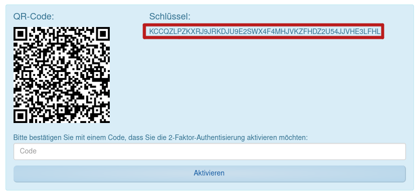

# 1blu ddns with multiple subdomains

This is a fork with the change that you can now give multiple subdomains to update:

```
 - e SUBDOMAI='sub1,sub,sub3,'

```


# 1Blu DDNS

This python script is used to dynamicly update the dns-records for the 1blu nameservers so, that a server is always accessible even if its ip-address gets changed. Different to most other providers 1blu sadly has no api for this purpose. Nevertheless it is possible to achieve this service by navigating through the menus like a human would. 

## Gettings Started

This service can be simply run as a docker container.
### Quick setup:
```
docker run -it -d \
      -e USERNAME=1234567 \
      -e PASSWORD=password \
      -e DOMAIN_NUMBER=123456 \
      -e OTP_KEY=ABCDEFGHIJKLMNOPQRSTUVWXYZABCDEFGHIJKLMNOPQRSTUVWXYZ \
      -e DOMAIN=example.de \
      -e LOGGING=INFO \
      -e CONTRACT=123123 \
      --name=1blu-ddns \
    jonasvoigt/1blu-ddns:latest
```
### Docker compose:
```
version: '3'
services:
  blu-ddns:
    image: jonasvoigt/1blu-ddns:latest
    restart: always
    environment:
      - USERNAME=1234567
      - PASSWORD=password
      - DOMAIN_NUMBER=123456
      - OTP_KEY=ABCDEFGHIJKLMNOPQRSTUVWXYZABCDEFGHIJKLMNOPQRSTUVWXYZ
      - DOMAIN=example.de
      - LOGGING=INFO
      - CONTRACT=123123
```

## Environment Variables

<code>USERNAME</code> Your 1blu username

<code>PASSWORD</code> Your 1blu password

<code>OTP_KEY</code> (optional) Your 1blu OTP key. If you don't have 2-factor authentification activated on your account, this variable can be ignored. Note: this is not the key that is used to log into your account. The code can be found when setting up teh otp.



<code>CONTRACT</code> The Contract Number of your 1Blu account. It can be found at https://ksb.1blu.de/products/ under Vertrags-No.

<code>DOMAIN_NUMBER</code> The domain number. To retrieve this, navigate to the dns editor. Now the domain number can be found in the url: ksb.1blu.de/\<contract-number\>/domain/\<domain-number\>/dns/ 

<code>DOMAIN</code> The domain without the subdomain. For example: "example.de" 

<code>SUBDOMAIN</code> (optional) The subdomain. If omitted, the maindomain will be used.

<code>RRTYPE</code> (optional) The rrtype. Can be either A (default) for ipv4 or AAAA for ipv6.


<code>INTERVAL</code> (optional) The interval between update tries in minutes. Defaults to 180. 

<code>LOGGING_LEVEL</code> (optional) The logging level. Can be one of the following:
- INFO (default): info, warnings and errors will be logged.
- WARNING: warnings and rrrors will be logged.
- ERROR: only errors will be logged
- DEBUG: info, warning, errors and debug messages will be logged.


## How this script works

### Sessions:
1blu uses sessions to verify that a request is allowed. Each session has a unique session-id. After logging it is possible with the session-id to make any change to the account, including changing the dns records. These sessions are only valid for a certain amount of time. This means that the script needs to be able to create new sessions and log in by itself.

### Creating sessions:
Creating a new session is not hard. When a request to the login page (https://ksb.1blu.de) is send, the server will return a new session id. This session-id is stored in the cookies as <code>PHPSESSID</code>. The cookies are included in the following requests. 

### Logging in:
After creating a new session, the script needs to log in so, that it can make changes to the dns-records. This is done by first sending a POST request to https://ksb.1blu.de with the following payload:

<code> _username=\<username\>&_password=\<password\>&_csrf_token=\<csrf-token\></code>

The csrf-token is retrieved by sending a GET request to https://ksb.1blu.de where it can be found in a hidden input field in the html-form on the page.

If 2fa is enabled, the next step is to generate a otp and send it with a POST request to https://ksb.1blu.de/2fa_check/. The request has the following payload:

<code> _auth_code=\<otp\>&_csrf_token=\<csrf-token\> </code>

This request also needs a csrf-token, which can be found at https://ksb.1blu.de/2fa/.

Finally the script validates, if the login was successful by checking if the start-page is accessible. 

### Retrieving the dns records:
The dns records are included in the page https://ksb.1blu.de/CONTRACT-NUMBER/domain/DOMAIN-NUMBER/dns/ encoded as json. 

<code>[{"id": 0,"hostname": "@","type": "A","target": "123.123.123.123"},
{"id": 1,"hostname": "www","type": "A","target": "123.456.789.10"},
{"id": 2,"hostname": "mail","type": "A","target": "123.123.234.234"},
{"id": 3,"hostname": "@","type": "MX","target": "mail.example.de","prio": "10"},
{"id": 4,"hostname": "example.de","type": "TXT","target": "text"},
{"id": 5,"hostname": "abc","type": "A","target": "78.78.78.80"}]
</code>

They are retrieved by the script and the stored as a list of dictionaries.

### Updating the dns records:
The dns records can be updated by sending a POST request to https://ksb.1blu.de/CONTRACT-NUMBER/domain/DOMAIN-NUMBER/dns/setdnsrecords/. The payload of the request does not only need to include the changed records but also all the unchanged ones too. 

<code> records[0][id]=0&records[0][hostname]=@&records[0][type]=A&records[0][target]=123.123.123.123&
records[1][id]=1&records[1][hostname]=www&records[1][type]=A&records[1][target]=123.456.789.10&
records[2][id]=2&records[2][hostname]=mail&records[2][type]=A&records[2][target]=123.123.234.234&
records[3][id]=3&records[3][hostname]=@&records[3][type]=MX&records[3][target]=mail.example.de&records[3][prio]=10
&records[4][id]=4&records[4][hostname]=example.de&records[4][type]=TXT&
records[4][target]=text&records[5][id]=5&records[5][hostname]=abc&records[5][type]=A&records[5][target]=78.78.78.80'</code>


### Checking if the dns records need to be updated:
After a defined Interval the script first checks, if the records need to be updated, by comparing its own ip-address with the one of the domain. The servers ip-address is retrieved by sending a request to https://v4.ident.me or https://v6.ident.me. For retrieving the domains ip-address the python library <code>dnspython</code> is used. If the ip-addresses are different the dns-records are updated as described above. 
